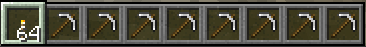
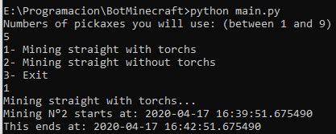

# Bot Mining Minecraft

A simple bot that mine in a straight way putting torches to the sides of the cave. Also, you can mine without putting torches.

## Getting Started

These instructions will get you a copy of the project up and running on your local machine for development and testing purposes. For now, this just works in Windows.

### Prerequisites

What things you need to install the software and how to install them

- Python 3+

- PyAutoGUI to control the mouse movement.
  ```
  pip install pyautogui
  ```
  Check this [link](https://pyautogui.readthedocs.io/en/latest/install.html) to get por information about the installation.

## Running the bot

- You have to setup your inventory like this:
  
  
- Run the main file
  ```
  python main.py
  ```
- Indicate the number of pickaxes you will use and if you want to mine with torchs or not.
  
  

- Enjoy!
## Demo

If you want to check how does it work, see this [video](https://streamable.com/c7qs4x)

## Built With

* [Python 3](https://www.python.org/) 
* [PyAutoGUI](https://pyautogui.readthedocs.io/en/latest/index.html) - PyAutoGUI lets your Python scripts control the mouse and keyboard

## Authors

- **Nicolás Liendro** - _Initial work_ - [GitLab](https://gitlab.com/NicoLiendro14) and 
  [GitHub](https://github.com/NicoLiendro14)

## License

This project is licensed under the GNU General Public License v3 (GPL-3) License - see the [LICENSE.md](LICENSE.md) file for details
